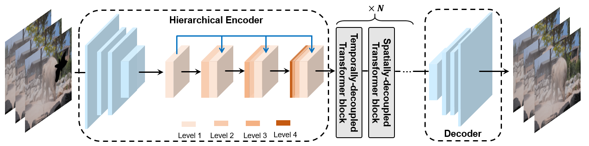
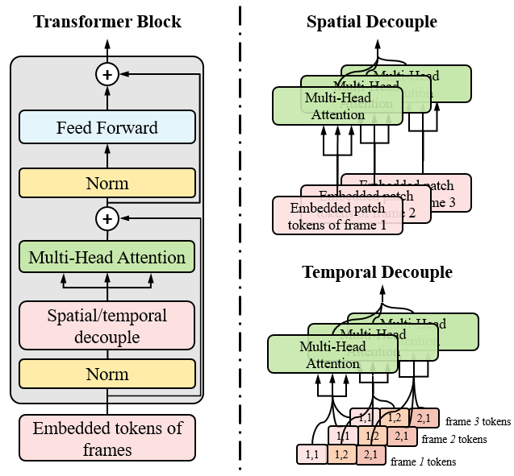

# Decoupled Spatial-Temporal Transformer for Video Inpainting

By [Rui Liu](https://ruiliu-ai.github.io), Hanming Deng, Yangyi Huang, Xiaoyu Shi, Lewei Lu, Wenxiu Sun, Xiaogang Wang, Jifeng Dai, Hongsheng Li. 

This repo is the official Pytorch implementation of [Decoupled Spatial-Temporal Transformer for Video Inpainting](https://arxiv.org/abs/2104.06637).

## Introduction

<div align=center></div>

## Citing DSTT
If you find DSTT useful in your research, please consider citing:
```
@article{liu_2021_DSTT,
  title={Decoupled Spatial-Temporal Transformer for Video Inpainting},
  author={Liu, Rui and Deng, Hanming and Huang, Yangyi and Shi, Xiaoyu and Lu, Lewei and Sun, Wenxiu and Wang, Xiaogang and Li Hongsheng},
  journal={arXiv preprint arXiv:2104.06637},
  year={2021}
}
```
